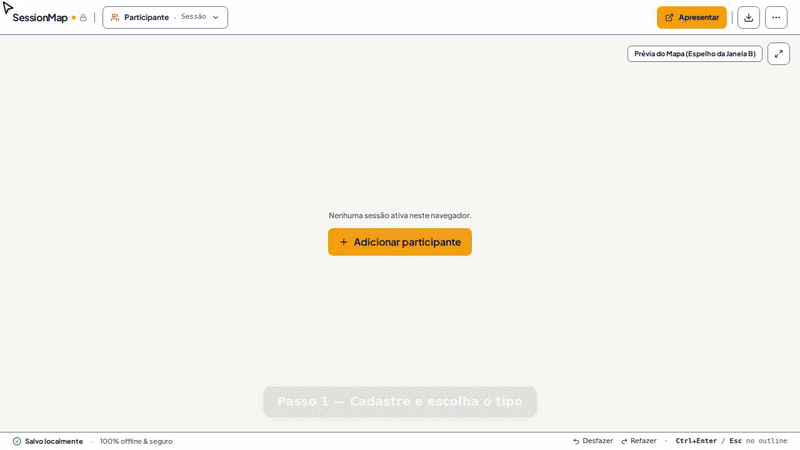

# SessionMap

[Leia em português](README.pt-BR.md)

Real-time mind map: you type topics and participants follow the map, in a
second window or projection — **100% offline and private by default**.

For consultants, mentors, teams — and any online meeting.
Free, open source, no install: open it in the browser and it works.

- **Use it now:** <https://calionauta.github.io/sessionmap/>
- **How it works:** [public page](https://calionauta.github.io/sessionmap/landing-en.html)
- **Full features:** [FEATURES-en.md](FEATURES-en.md)

## How it works (30 seconds)



1. Register the participant under **Participants & Sessions** and start a session (pick the
   type and, optionally, a starter script).
2. Click **Present** and project/share only the participant window.
3. Type the topics: each line becomes a balloon on the participant's map, live.
4. **End presentation** closes the window; presenting again reopens where you left off.

The participant window never shows menus, outline, private notes, or the participant's
name in the tab — only the map.

## Privacy

- Everything stays in the browser (IndexedDB + `localStorage`); window-to-window sync
  uses a local `BroadcastChannel`. No account, no server, no tracking.
- Your notes about each participant are never transmitted.
- The only data that ever leaves the browser is the **cloud backup** ([Puter](https://puter.com)),
  off by default — you turn it on when you want,
  always encrypted in the browser (AES-256-GCM) with a password that lives only in your
  memory.

## Backup

- **Local:** full JSON backup (sessions, participants, types, scripts) with
  restore, plus Markdown/OPML/FreeMind/PNG/SVG and per-participant or full ZIPs.
- **Cloud:** Settings → Cloud backup: connect to Puter, set the
  password, send manually or automatically (~1 min after you stop, 5 min ceiling). Deleting
  everything requires typing `DELETE`. Lost the password? Local data is intact — start over
  with a new one and the next upload replaces the unreadable file.
- **Language:** Settings → Language, PT or EN for the whole interface;
  the public page detects the browser language on first visit
  (details in [FEATURES-en.md](./FEATURES-en.md)).

## Development

```bash
bun install
bun run dev      # http://localhost:3000
bun test         # 276 tests
bun run lint     # tsc --noEmit
bun run build    # dist/ (published to GitHub Pages from main)
```

- Stack: React 19 + Vite 8 + Tailwind 4 + TypeScript; IndexedDB + `localStorage`.
- Deploy: pushing to `main` publishes `dist/` to GitHub Pages.
- Conventions and docs-sync rule in [AGENTS.md](AGENTS.md).

## Layout

```
src/
  components/   # HostView, ClientView, mindmap, outline, modals, admin, ui
  services/     # storage (IDB), sync, export, cloudCrypto, puterCloud, cloudBackup
  utils/        # Markdown parser, tree, layout, export
  types/        # MindMap, Client, Modality, SessionTemplate, Settings
public/
  landing.html     # public page in Portuguese (copied to dist/ on build)
  landing-en.html  # public page in English (copied to dist/ on build)
FEATURES-en.md     # full feature inventory (in English)
AGENTS.md          # agent instructions (includes docs-sync rule)
```
